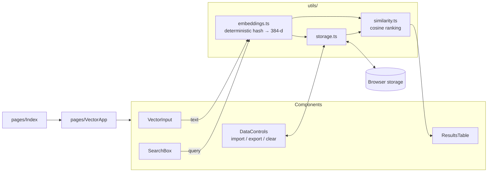

# Architecture

A 100% client-side vector database demo: text → 384-d hash embeddings → cosine-similarity search, stored in the browser.

```mermaid
flowchart LR
    Index[pages/Index] --> VA[pages/VectorApp]
    subgraph Components
        VI[VectorInput]
        SBox[SearchBox]
        RT[ResultsTable]
        DC[DataControls<br/>import / export / clear]
    end
    subgraph Utils["utils/"]
        Emb[embeddings.ts<br/>deterministic hash → 384-d]
        Sim[similarity.ts<br/>cosine ranking]
        Stor[storage.ts]
    end
    LS[(Browser storage)]

    VA --> Components
    VI -->|text| Emb --> Stor
    SBox -->|query| Emb --> Sim
    Stor --> Sim --> RT
    Stor <--> LS
    DC <--> Stor
```
